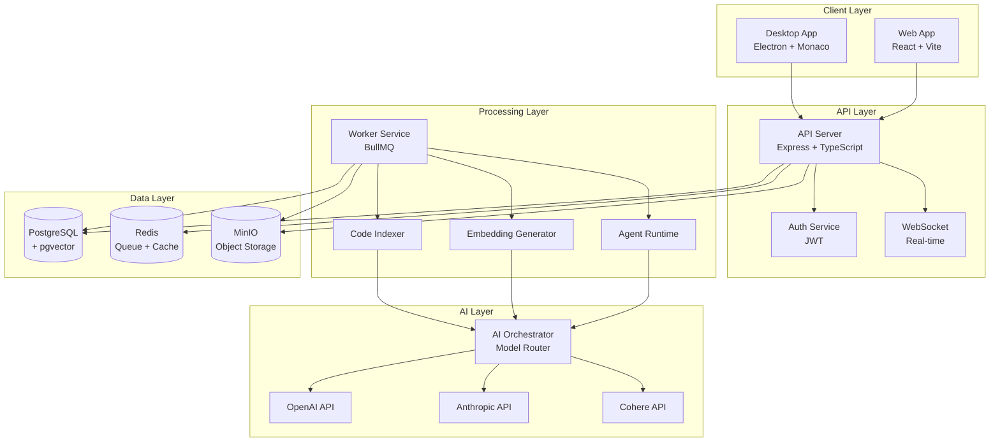
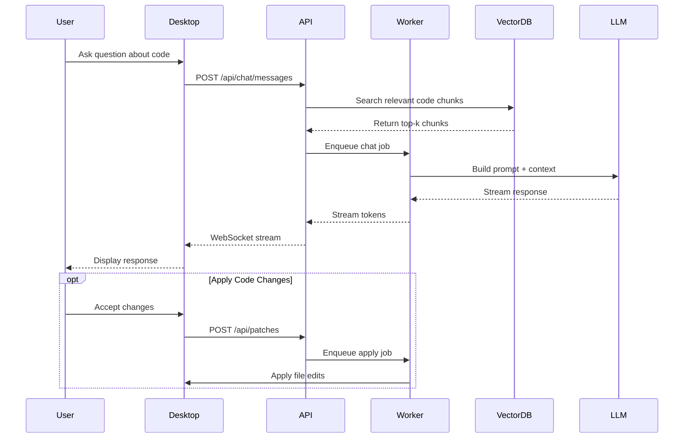

# Smart-AI-Cursor — AI-First Coding Workspace (Cursor-like AI IDE)

smart-ai-cursor is an AI-first developer workspace inspired by Cursor, designed to provide
repository-aware chat, semantic code search, safe multi-file editing, agent workflows,
and patch-based code generation.

The platform is built using a modular monorepo architecture with React, Node.js,
TypeScript, vector search, and agent orchestration, enabling production-style
AI-assisted software engineering.

This project is not a copy of Cursor internals.
It is a clean-architecture implementation of a modern AI coding platform.

## 🚀 Features

- **Intelligent Code Completion**: Context-aware AI suggestions powered by GPT-4 and Claude
- **Codebase Chat**: Ask questions about your codebase with RAG-powered retrieval
- **Multi-Agent System**: Autonomous agents for complex refactoring tasks
- **Real-time Collaboration**: Share sessions and collaborate with your team
- **Vector-based Code Search**: Semantic search across your entire codebase
- **Terminal Integration**: Execute commands and get AI assistance in your terminal
- **Diff Viewer**: Review AI-generated changes before applying them
- **Multi-Model Support**: OpenAI, Anthropic, Cohere, and custom models
- **Desktop & Web Apps**: Native Electron desktop app and web interface
- **Enterprise Ready**: Self-hostable with comprehensive audit logging

## 📊 Architecture



## 🔄 Chat Interaction Flow



## 🏗️ Monorepo Structure

```
codepilot/
├── apps/
│   ├── api/              # Express REST API + WebSocket server
│   ├── worker/           # Background job processor (indexing, embeddings)
│   ├── web/              # React web application (Vite)
│   └── desktop/          # Electron desktop application
├── packages/
│   ├── shared/           # Shared types, DTOs, constants
│   ├── ui/               # Reusable React components
│   ├── editor-sdk/       # Editor abstraction layer
│   ├── ai-orchestrator/  # Prompt building, model routing, safety
│   └── retrieval/        # Chunking, embedding, vector search
├── infra/
│   ├── docker/           # Dockerfiles for each service
│   ├── k8s/              # Kubernetes manifests
│   └── terraform/        # Infrastructure as Code
├── docs/
│   ├── architecture/     # Architecture documentation
│   └── adr/              # Architecture Decision Records
└── scripts/              # Utility scripts (seed, migrate)
```

## 🛠️ Tech Stack

### Backend
- **Runtime**: Node.js 20+ with TypeScript
- **API Framework**: Express.js
- **Database**: PostgreSQL 16 + pgvector extension
- **Cache/Queue**: Redis + BullMQ
- **Object Storage**: MinIO (S3-compatible)
- **Authentication**: JWT with bcrypt

### Frontend
- **Desktop**: Electron 28 + Monaco Editor
- **Web**: React 18 + Vite + React Router v6
- **State Management**: Zustand
- **Styling**: Tailwind CSS
- **UI Components**: Custom component library

### AI/ML
- **LLM Providers**: OpenAI (GPT-4), Anthropic (Claude), Cohere
- **Embeddings**: OpenAI text-embedding-3-small
- **Vector Store**: PostgreSQL + pgvector
- **Reranking**: Cohere Rerank API

### DevOps
- **Containerization**: Docker + Docker Compose
- **Orchestration**: Kubernetes
- **IaC**: Terraform
- **Monitoring**: (Sentry, Prometheus - to be integrated)

## 🚦 Getting Started

### Prerequisites

- Node.js 20+
- pnpm 8+
- Docker & Docker Compose
- PostgreSQL 16+ (or use Docker)
- Redis (or use Docker)

### Installation

1. **Clone the repository**
```bash
git clone https://github.com/yourusername/codepilot.git
cd codepilot
```

2. **Install dependencies**
```bash
pnpm install
```

3. **Set up environment variables**
```bash
cp .env.example .env
# Edit .env with your API keys and configuration
```

4. **Start infrastructure services**
```bash
docker-compose up -d
```

5. **Run database migrations**
```bash
pnpm db:migrate
```

6. **Seed initial data (optional)**
```bash
pnpm db:seed
```

7. **Start development servers**
```bash
# Start all services
pnpm dev

# Or start individual services
pnpm dev:api      # API server on port 3000
pnpm dev:worker   # Worker service
pnpm dev:web      # Web app on port 5173
pnpm dev:desktop  # Desktop app
```

### Verify Installation

```bash
# Check API health
curl http://localhost:3000/health

# Check database connection
docker exec -it codepilot-postgres psql -U codepilot -c "SELECT version();"

# Check Redis connection
docker exec -it codepilot-redis redis-cli ping
```

## 📦 Building for Production

```bash
# Build all packages and apps
pnpm build

# Build specific app
pnpm build:api
pnpm build:web
pnpm build:desktop
```

## 🧪 Testing

```bash
# Run all tests
pnpm test

# Run tests for specific package
pnpm --filter @codepilot/shared test
```

## 🔐 Security

- All API endpoints require JWT authentication (except public routes)
- Rate limiting on all endpoints (configurable)
- Prompt injection detection and sanitization
- Secrets redaction in logs and responses
- SQL injection prevention via parameterized queries
- CORS configuration for web clients
- Content Security Policy headers

## 🗺️ Roadmap

### Phase 1: Core Platform (Current)
- [x] Monorepo setup with pnpm workspaces
- [x] Express API with modular architecture
- [x] React web app with routing
- [x] Electron desktop app with Monaco
- [x] PostgreSQL + pgvector setup
- [x] Redis queue with BullMQ
- [ ] JWT authentication flow
- [ ] Code indexing pipeline
- [ ] Embedding generation
- [ ] Vector search implementation

### Phase 2: AI Features
- [ ] Chat with codebase (RAG)
- [ ] Code completion
- [ ] Inline code suggestions
- [ ] Multi-turn conversations
- [ ] Context-aware prompts
- [ ] Model router (GPT-4, Claude, etc.)
- [ ] Streaming responses

### Phase 3: Advanced Features
- [ ] Multi-agent system
- [ ] Autonomous refactoring
- [ ] Test generation
- [ ] Code review automation
- [ ] Terminal integration
- [ ] Voice input/output
- [ ] Collaborative sessions

### Phase 4: Enterprise Features
- [ ] Self-hosting documentation
- [ ] RBAC and permissions
- [ ] Audit logging
- [ ] Usage analytics
- [ ] Billing integration (Stripe)
- [ ] SSO/SAML support
- [ ] On-premise deployment

### Phase 5: Ecosystem
- [ ] VS Code extension
- [ ] JetBrains plugin
- [ ] Vim/Neovim plugin
- [ ] CLI tool
- [ ] API SDK for third-party integrations
- [ ] Plugin marketplace

## 📚 Documentation

- [Backend Architecture](./docs/architecture/backend.md)
- [Retrieval System](./docs/architecture/retrieval.md)
- [Agent Runtime](./docs/architecture/agent-runtime.md)
- [Security Model](./docs/architecture/security.md)

### Architecture Decision Records
- [ADR 0001: Monorepo Choice](./docs/adr/0001-monorepo-choice.md)
- [ADR 0002: Vector Store Choice](./docs/adr/0002-vector-store-choice.md)
- [ADR 0003: Electron vs Tauri](./docs/adr/0003-electron-vs-tauri.md)

## 🤝 Contributing

Contributions are welcome! Please see [CONTRIBUTING.md](./CONTRIBUTING.md) for details.

1. Fork the repository
2. Create a feature branch (`git checkout -b feature/amazing-feature`)
3. Commit your changes (`git commit -m 'Add amazing feature'`)
4. Push to the branch (`git push origin feature/amazing-feature`)
5. Open a Pull Request

## 📄 License

This project is licensed under the MIT License - see the [LICENSE](./LICENSE) file for details.

## 🙏 Acknowledgments

- Inspired by [Cursor](https://cursor.sh/)
- Built with amazing open-source tools and libraries
- Community contributors and supporters
